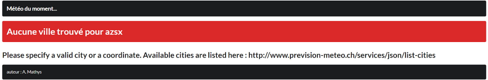

# Prévision Météo 

Contributions most welcome.

## Contents

1. [Installation](#installation)
2. [Utilisation](#utilisation)
3. [Licence](#Licence)

## Installation
* git clone https://github.com/royal1er/Meteo.git
* cd meteo
* node index.js

## Utilisation

Le projet exploite l'api du site prevision-meteo.ch :  https://www.prevision-meteo.ch/services

* Après avoir lancé le projet à l'aide de la commande "node index.js" il faut renseigner l'URL suivant dans le moteur de recherche : http://localhost:3000/ . Une fois l’adresse “http://localhost:3000/” saisie on obtient la vue ci-dessous :

* Lorsqu'une ville est saisie le projet liste les informations météo pour le jour actuels et les suivants :

* Il est possible que le site ne liste pas les informations météo pour une ville saisie parce qu'elle n'est pas renseignée dans l'api ou qu'elle soit mal saisie, dans ce cas on obtient la vue suivante.

## Licence

To the extent possible under law, [Allebe Mathys](https://florianallebe6.wixsite.com/website) has waived all copyright and related or neighboring rights to this work.
